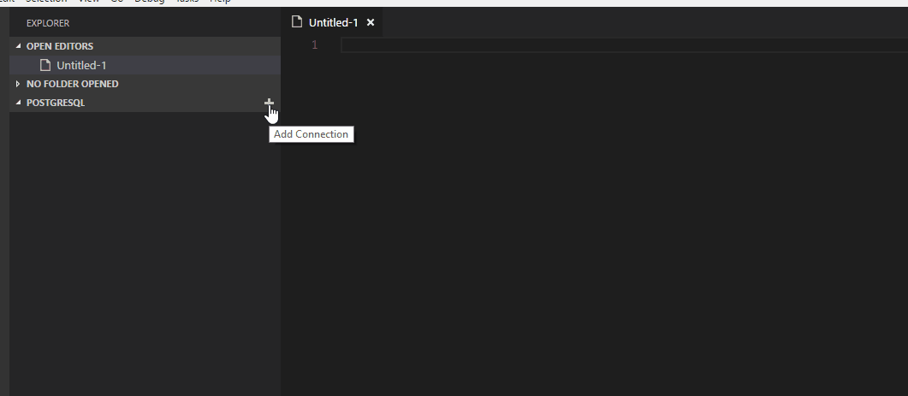
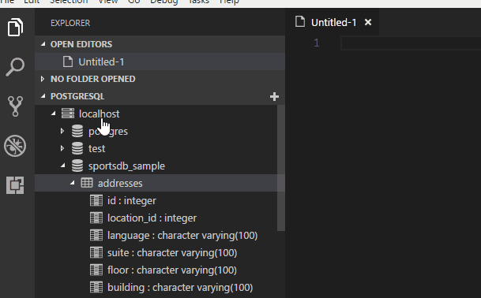
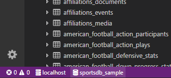
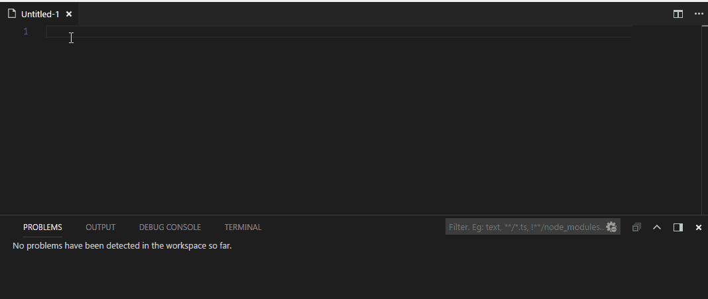
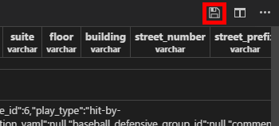

# PostgreSQL

This is a query tool for PostgreSQL databases.  While there is a database explorer it is _NOT_ meant for creating/dropping databases or tables.  The explorer is a visual aid for helping to craft your queries.

There is a language service that should keep at most a single connection open to the database (assuming one was selected).  This facilitates query diagnostics, code completion, and function signatures.  All code completion keywords, functions, tables, and field names are pulled from the current connection to try to keep everything relevant.

It is possible there are some queries that won't run and report problems - even if they are completely valid (`DROP DATABASE` comes to mind).

> *__Note__: PostgreSQL versions before 9.4 are not supported.*

## Features

* Management of PostgreSQL connections
* List Servers/Database/Functions/Tables/Columns (primary key/type)
* Quickly select top * (with limit) of a table
* Run Queries
  * All queries in a pgsql file (; delimited)
  * Selected query in pgsql file
  * Selected query in ANY file (via context menu or command palette)
* Individual editors can have different connections
* Quickly change connection database by clicking the DB in the status bar
* Syntax Highlighting
* Connection aware code completion (keywords, functions, tables, and fields)
* In-line error detection powered by EXPLAIN (one error per query in editor)
* *__Basic__* function signature support (connection aware)

## Usage

### Managing Connections

You can add a PostgreSQL connection in the explorer or via the command palette command "PostgreSQL: Add Connection"

You can remove connections from the connection context menu or the command palette command "PostgreSQL: Delete Connection".

Each item in the explorer has it's own context menu, and you can start a new query from _any_ level (or the command palette "PostgreSQL: New Query").

The "Refresh Items" option reloads the sub-nodes for that item, useful if there were structural changes to the database and you want the explorer to reflect them.

Tables have the extra option to "Select Top 1000" or "Select Top...". They both open a new query with a "SELECT *" query started and run it.  The latter option will prompt you for the quantity first.

### Running Queries

Each editor window can have a different database and/or connection used for its queries.  All windows start with no connection selected.

Clicking on the server ("localhost" above) or the database name will allow you to quickly change the database.  You can also initiate the change from the command palette.

Windows with their language set to Postgres will get syntax highlighting, and when there is connection selected: code completion, signature information, and diagnostics.

In Postgres language files you can run a query via F5, context menu, or command palette.  You can also run a query from any other file type as long as a connection is selected and you have the query selected - __*F5 will not work for other file types*__.

Running queries in Postgres language files first check if anything is selected. If there is a selection, that is run as the query, otherwise all the queries in the editor are run.

Multiple queries are supported. If there is output from more than one query, multiple tables are shown in the results window.

### Serializing Query Results

You can serialize your query results as well.

If you have more than one table of results, you will be prompted for the table you wish to serialize.

You can choose from three formats: json, xml, and csv.  The results will be converted to the appropriate format and opened in a new editor of the selected type.

## Extension Settings

This extension contributes the following settings:

* `vscode-postgres.showExplorer`: enable/disable the database explorer.
* `vscode-postgres.prettyPrintJSONfields`: set to `true` to enable nicely formatted JSON in the query results window.
* `vscode-postgres.setConnectionFromExplorer`: set to `ifunset` to only set the query connection if not already set.
* `vscode-postgres.tableColumnSortOrder`: set to `db-order` to sort columns like the database does, `alpha` to sort alphabetically, and `reverse-alpha` for descending alphabetically.
* `vscode-postgres.intervalFormat`: set to `iso_8601` to format intervals according to the ISO 8601 standard, `humanize` to format as easy to read text, and `succinct` to format like a countdown clock.
* `vscode-postgres.virtualFolders`: set to array of virtual folders to be displayed under schema. Supported values for virtual folders are `functions`. Set to `null` or empty array `[]` to disable virtual folders.
* `vscode-postgres.defaultConnection`: set the default connection (by name) that should be used for any file.
* `vscode-postgres.defaultDatabase`: set the default database on the default connection that should be used for any file (must exist on server).